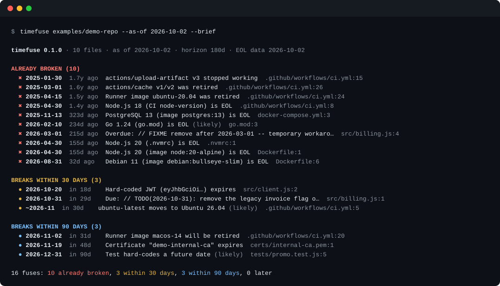

<div align="center">

# timefuse

**Find the code in your repo that will break on a specific date.**

EOL runtimes, retiring CI runners, expiring certificates, dated TODOs: one command, one timeline, no network.

[](https://github.com/Nithinfgs/timefuse/actions/workflows/ci.yml)
[](LICENSE)




</div>

```bash
npx github:Nithinfgs/timefuse            # scan the current directory
npx github:Nithinfgs/timefuse --as-of 2027-06-01   # what is broken by then?
```

## The 20-second version

Most outages from "nothing changed" are really *the calendar changed*: a base image went EOL, a runner image was retired, a certificate lapsed, a `TODO(2026-03-01)` went overdue, or `ubuntu-latest` quietly moved to a new Ubuntu. Dependabot and `npm audit` look at *versions*. timefuse looks at *dates*.

It reads your repo (read-only), finds everything that has a deadline attached, and prints a single timeline: **already broken**, **breaks within 30 days**, **within 90 days**. Every finding has a `file:line` and, where possible, a fix hint.

The **`--as-of` flag is a time machine.** Ask "what will be on fire on 1 June?" and get an answer today.

## Why this exists

- Runtime and base-image EOL dates are scattered across `.nvmrc`, `Dockerfile`, CI matrices, `go.mod`, `docker-compose.yml`, and nobody checks them all.
- CI breakage from retired runner images and removed actions (`upload-artifact@v3`, `ubuntu-20.04`) always arrives as a surprise red build on a day you didn't choose.
- Certificates and JWTs committed to a repo (test fixtures, internal CAs) expire silently.
- A `TODO` with a date is a promise. Nothing enforces it.

timefuse is deliberately small: it does not resolve dependency trees, call vulnerability databases, or need an account. It answers one question well: *what in this repo has an expiry date, and when is it?*

## Quick start

Requires Node.js 22 or newer. No install step and no runtime dependencies.

```bash
# one-off, straight from GitHub
npx github:Nithinfgs/timefuse

# or clone it
git clone https://github.com/Nithinfgs/timefuse && cd timefuse
node bin/timefuse.js /path/to/your/repo
```

Try the bundled demo repository (it is full of deliberate time bombs):

```bash
npm run demo
```

> An npm registry package (`npx timefuse`) is planned; until it is published, use the `github:` form above.

## Use it in CI

Fail the build when anything is already broken or about to break:

```yaml
# .github/workflows/timefuse.yml
name: timefuse
on:
  schedule: [{ cron: "0 7 * * 1" }]   # weekly: dates move even when your code doesn't
  pull_request:
jobs:
  fuses:
    runs-on: ubuntu-24.04
    steps:
      - uses: actions/checkout@v5
      - uses: actions/setup-node@v5
        with: { node-version: 24 }
      - run: npx --yes github:Nithinfgs/timefuse --fail-within 30d
```

Exit codes: `0` ok · `1` something breaks inside `--fail-within` · `2` bad input.

## What it detects

| Rule | Looks at | Example finding |
| --- | --- | --- |
| `runtime-eol` | `.nvmrc`, `.node-version`, `.python-version`, `.ruby-version`, `.tool-versions`, `go.mod`, `Pipfile`, `runtime.txt`, `package.json` engines (pinned only), Django/Rails pins, CI `*-version` inputs incl. matrices | `Node.js 20 (.nvmrc) is EOL` |
| `image-eol` | `Dockerfile*`, `docker-compose.yml`, any YAML with `image:` (Kubernetes, GitLab CI) | `Debian 11 (image debian:bullseye-slim) is EOL` |
| `runner-eol` | GitHub Actions `runs-on` / matrix labels | `Runner image macos-14 will be retired` |
| `action-deprecated` | `uses:` pinned to removed majors (`upload-artifact@v3`, `cache@v2`) | `actions/upload-artifact v3 stopped working` |
| `floating-label` | `ubuntu-latest` and friends, when a move is announced | `ubuntu-latest moves to Ubuntu 26.04` |
| `cert-expiry` | PEM certificates anywhere in the repo | `Certificate "internal-ca" expires` |
| `jwt-expiry` | Hard-coded JWTs with an `exp` claim (never verified, never sent anywhere) | `Hard-coded JWT (eyJhbGciOi…) expires` |
| `dated-marker` | `TODO`/`FIXME`/`REMOVE`/`SUNSET`… comments carrying an ISO date | `Overdue: // FIXME remove after 2026-03-01` |
| `test-future-date` | Hard-coded near-future dates in test files (skipped when the file fakes the clock) | `Test hard-codes a future date` |

EOL data comes from [endoflife.date](https://endoflife.date) (bundled snapshot, dated in the report header). Runner-image and action rules that endoflife.date doesn't model live in [`data/rules.json`](data/rules.json), each with a source link.

## Options

```text
timefuse [path] [options]
  --as-of <YYYY-MM-DD>      pretend today is this date
  --within <duration>       horizon: 30d, 12w, 6m, 1y          (default 180d)
  --fail-within <duration>  exit 1 if anything breaks inside this window (0d = already broken only)
  --format text|json|markdown
  --min-confidence high     hide "(likely)" heuristics
  --brief                   one line per finding
  --ignore <glob>           skip paths (repeatable)
  --eol-file <file>         use your own EOL data
timefuse update-data        refresh EOL data from endoflife.date (the only network call)
```

Per-repo config in `.timefuse.json`:

```json
{ "ignore": ["examples/**", "vendor/**"], "within": "1y", "disableRules": ["test-future-date"] }
```

Silence a single line with a `timefuse-ignore` comment on it or on the line above.

## How it works

```
 git ls-files ──▶ file reader ──▶ detectors ──▶ findings ──▶ timeline report
 (or dir walk)    (text, ≤1 MB)   (9 rules)     {date,file,    text | json | markdown
                                                 line,fix}
                       ▲
        data/eol.json (endoflife.date snapshot) + data/rules.json
```

- Each detector is a small module: `appliesTo(path)` plus `scan(file, ctx)` returning findings with a date. See [docs/how-it-works.md](docs/how-it-works.md).
- Everything is computed relative to `--as-of`, so results are reproducible and testable.
- Scanning is read-only. The only network access is the explicit `update-data` command.
- Findings are tagged `high` or `likely` confidence. Heuristics (test dates, approximate announcements) are marked so you can filter them.

## Limitations (read before trusting it)

- **It reports dates; it does not know whether you are affected.** `Go 1.24 (go.mod)` is a language *floor*, so it is marked "likely". Check before panicking.
- Ranges like `"node": ">=18"` are treated as a support floor and ignored. Only pins (`^20`, `20.x`) are flagged.
- It does not resolve transitive dependencies or fetch an action's `runs.using`; deprecated action majors are a small curated list.
- The `ubuntu-latest` date is announced only as "November 2026", so it is shown as approximate (`~2026-11`).
- EOL data is a snapshot. Run `timefuse update-data` for fresh data, or `--eol-file` for your own.
- Heuristic rules (`dated-marker`, `test-future-date`) can produce false positives. Use `--min-confidence high` or `timefuse-ignore`.

## Roadmap

- [ ] npm registry release
- [ ] SARIF output for GitHub code scanning
- [ ] Opt-in network mode: read `runs.using` of each referenced action, check TLS certificates of URLs in config
- [ ] More ecosystems: Java/Kotlin (Gradle toolchains), .NET target frameworks, Terraform provider and Kubernetes API versions
- [ ] Package-level deprecations from lockfiles (offline, from a bundled index)
- [ ] `timefuse fix` for mechanical bumps (`@v3` to `@v4`, `ubuntu-20.04` to `ubuntu-24.04`)

## Contributing

New detectors and data rules are the most useful contributions; each is a small file plus a test. See [CONTRIBUTING.md](CONTRIBUTING.md). Found a false positive? Open an issue with the offending line.

```bash
npm install
npm test           # node:test, no framework
npm run typecheck  # tsc --checkJs, strict
```

## License

[MIT](LICENSE). EOL data from [endoflife.date](https://endoflife.date) is CC BY-SA 4.0.
